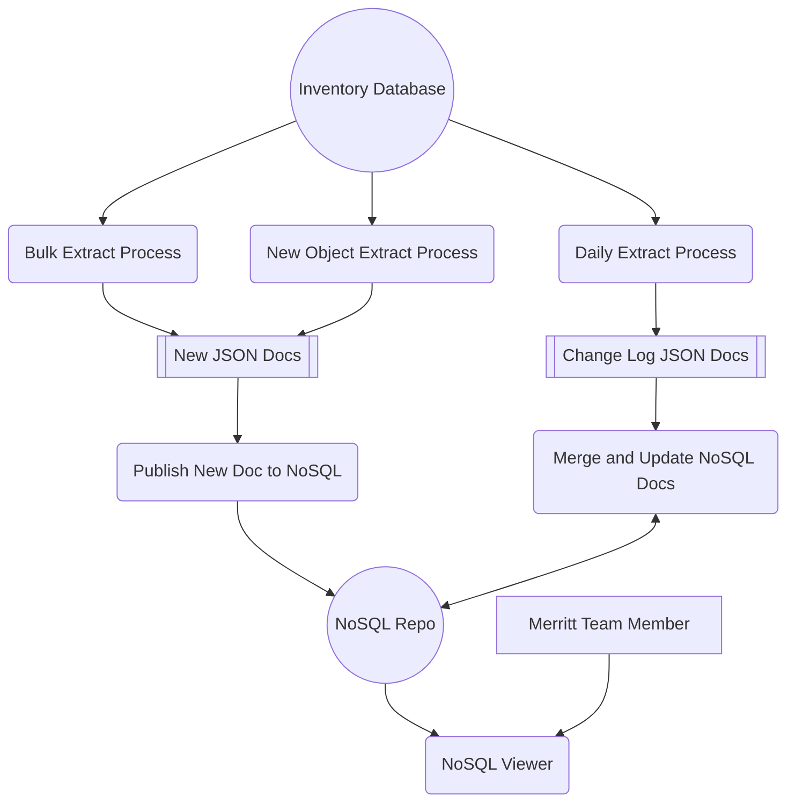
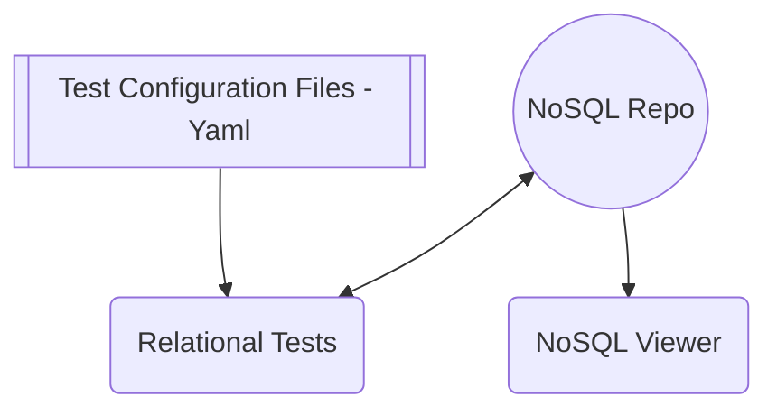
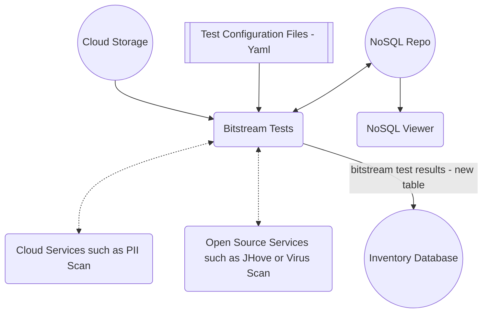
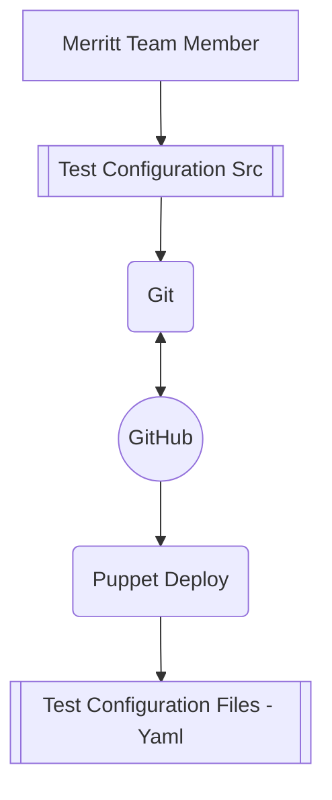
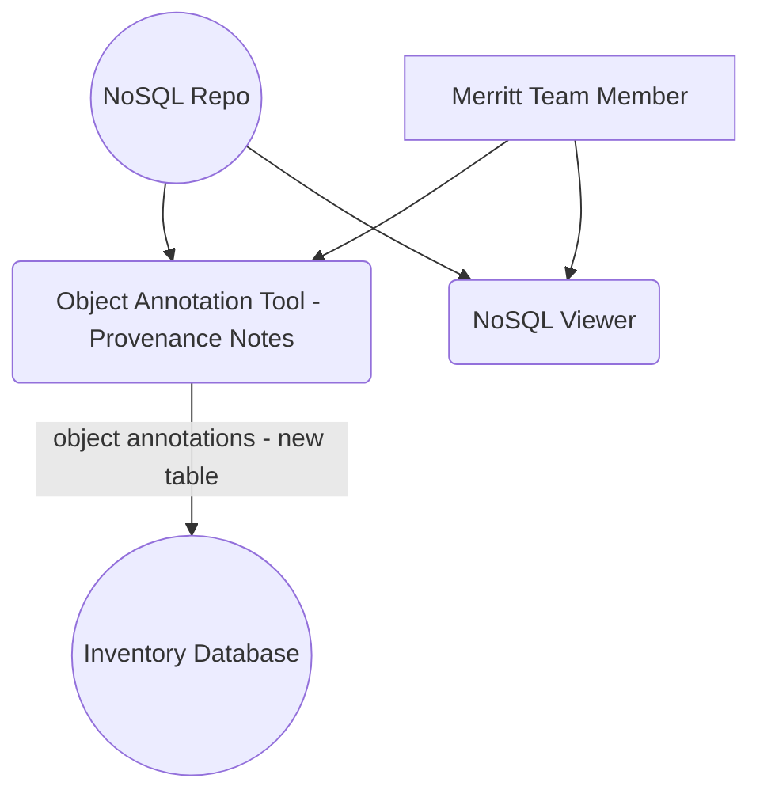

# Collection Heath Object Analysis

## System Design

### Analysis Preparation


### Test Execution - Relational Tests
Fast, inexpensive tests, should be easy to stay up to date.  Tests may need to be re-run if the rule configration files change.
Test results are probably not worth storing in MySQL.



### Test Execution - Bitstream Tests
Expensive tests that may need to be scheduled or prioritized. As the underlying services that perfom the operations improve, these tests should be re-run.
Because tests are expensive to execute, test results should be recoded in the inventory database.




### Test Rule Refinement
Merritt Team members will make routine changes to test configurations
- due to updates the the list of sustainable format types
- applying optional and configurable tests to specific Merritt collections



### Annotating Object Exceptions
This tool will be created if needed.  This would provide a mechanism to record exceptional events that occurred in the life of an object or to record the conclusions of an investigation of object content.
In general, most objects should not have an annotation.  This tool would be used to prevent duplicated investigation of specific objects.



## Candidate Tests

### Relational Tests
- File level
  - Mime type sustainability
  - Filename validation
  - Empty file detection
- Object level
  - Object has content files
  - Object has sidecar metadata
  - Object has content + sidecar metadata
  - Object has meaningful ERC metadata
  - Object has local id
- Contextual checks (repo)
  - Unique file checksum
- Contextual checks (collection)
  - File name conforms to naming standards for collection
  - Local id conforms to naming standards for collection
  - ERC metadata conforms to naming standards for collection
  - File size is within typical size range for the collection

### Bitstream Tests
- PII scan using AWS service
- Virus scan - ClamAV, Other?
- Format Identification Scan
  - Format matches mime type
  - Format valid
  - Format profile validation (examine use of optional features within a format)

## Prototype Object Analysis Schema

```yaml
object:
  id: 222
  identifiers:
    ark: "ark://12345/abcde"
    local-ids: ['aaa', 'bbb']
  container:
    collection: "mnemonic"
    owner: "ABCD"
  modified: "2023-01-01 11:22:33"
  metadata:
    who: "aaa"
    what: "bbb"
    when: "ccc"
  key-changes:
    versions-with-embargo: [1,2]
    versions-with-delete: [2]
  producer-files:
    versions:
      num: 1
      files: 
      - id: 234
        path: "bbb"
        billable_size: 123
        md5: "aaa"
        mime_type: "image/tiff"
        # I presume we would want to store these results in MySQL as well
        analyis-traits:
          # sustainable | at-risk | unsustainable | unknown
          format-sustainability: "sustainable"
          format-id-scan:
            result: "PASS"
            details: {}
            last-run: "2023-01-01 11:22:33"
          virus-scan:
            result: "FAIL"
            details: {}
            last-run: "2023-01-01 11:22:33"
          pii-scan-results:
            result: "PASS"
            details: {}
            last-run: "2023-01-01 11:22:33"
  analysis-test-log:
  - test-name: "cccc"
    # test-type
    #   file-metadata: tests that rely only on file metadata
    #   file-bitstream: tests that rely on scanning file bitstream content 
    #   object-metadata: tests that rely only on object metadata
    #   object-composition: tests that analyze the combination of files
    #   collection-consistency: tests based on collection expectation and collection configuration files
    test-type: "xxx"
    test-result: "WARN"
    result: "PASS"
    details: {}
    last-run: "2023-01-01 11:22:33"
    # each test will have an inherent expiration... when does it need to run again
    expiration: "..."
  annotation-notes:
  - date: ""
    note: ""
  test-excetpions:
  - test-type: "xxx"
    exception-status: "SKIP"
    exception-note: "..."
```
