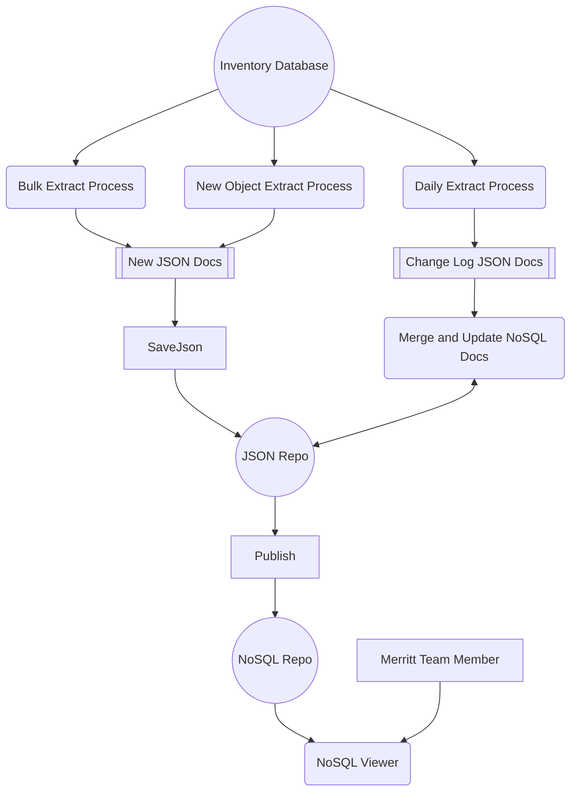
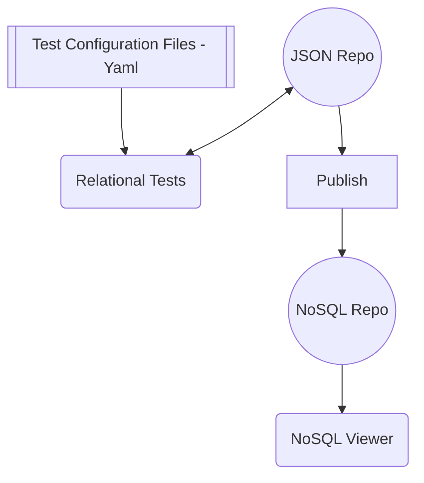
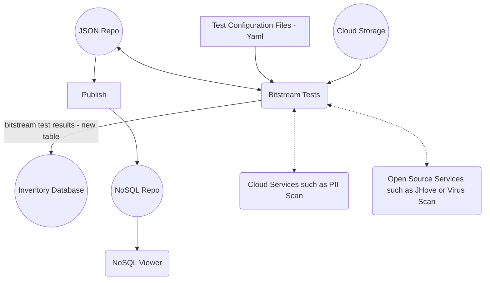
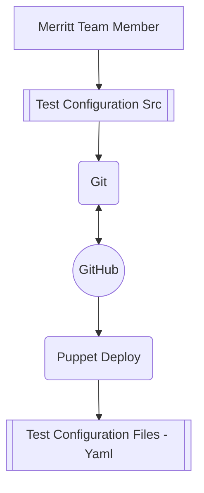
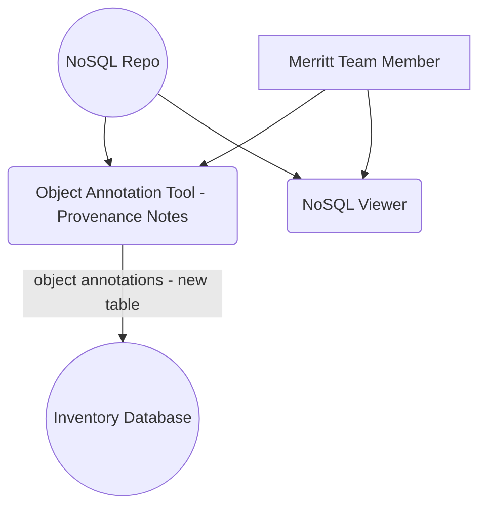

# Collection Health Object Analysis


## Set environment (DEV)
```
export COLLHDATA=$PWD
```

## Set environment
```
export COLLHDATA=/dpr2/apps/mrt-cron/coll_health/data
cd {merrit-cron-install}/coll-health-object-analysis
```

## New Database Table
_Copy to https://github.com/CDLUC3/mrt-admin-lambda/blob/main/merrit-billing/schema.sql when complete._

```sql
/*
DROP TABLE IF EXISTS object_health_json;
*/
CREATE TABLE object_health_json (
  inv_object_id int,
  build json,
  build_updated datetime,
  analysis json,
  analysis_updated datetime,
  tests json,
  tests_updated datetime,
  UNIQUE INDEX object_id(inv_object_id)
);
```
## Install
```
bundle install
```

## Invocation
```
bundle exec ruby object_health.rb
```


## System Design

### Analysis Preparation


### Test Execution - Relational Tests
Fast, inexpensive tests, should be easy to stay up to date.  Tests may need to be re-run if the rule configration files change.
Test results are probably not worth storing in MySQL.



### Test Execution - Bitstream Tests
Expensive tests that may need to be scheduled or prioritized. As the underlying services that perfom the operations improve, these tests should be re-run.
Because tests are expensive to execute, test results should be recoded in the inventory database.




### Test Rule Refinement
Merritt Team members will make routine changes to test configurations
- due to updates the the list of sustainable format types
- applying optional and configurable tests to specific Merritt collections



### Annotating Object Exceptions
This tool will be created if needed.  This would provide a mechanism to record exceptional events that occurred in the life of an object or to record the conclusions of an investigation of object content.
In general, most objects should not have an annotation.  This tool would be used to prevent duplicated investigation of specific objects.



## Interesting Open Search Queries
- build.file_counts.deleted > 0 AND build.producer.deleted: true
- `build.file_counts.deleted > 0 AND build.producer.deleted: true`