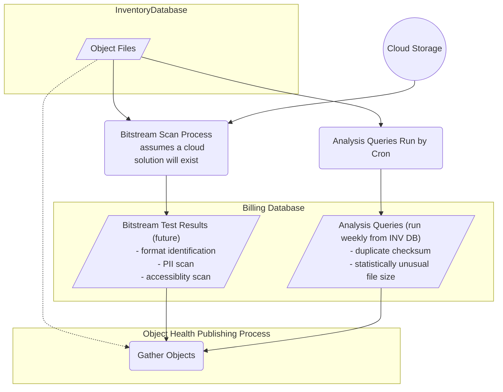

# Collection Health Object Analysis


## Set environment (DEV)
```
export COLLHDATA=$PWD
```

## Set environment
```
export COLLHDATA=/dpr2/apps/mrt-cron/coll_health/data
cd {merrit-cron-install}/coll-health-object-analysis
```

## New Database Table
_Copy to https://github.com/CDLUC3/mrt-admin-lambda/blob/main/merrit-billing/schema.sql when complete._

```sql
/*
DROP TABLE IF EXISTS object_health_json;
*/
CREATE TABLE object_health_json (
  inv_object_id int,
  build json,
  build_updated datetime,
  analysis json,
  analysis_updated datetime,
  tests json,
  tests_updated datetime,
  UNIQUE INDEX object_id(inv_object_id)
);
```
## Install
```
bundle install
```

## Invocation
```
bundle exec ruby object_health.rb
```


## System Design

### Analysis Preparation - Initial Solution


### Analysis Preparation - Extended Analysis
These components will be more compuationally expensive to implement.  
The results of these analyses should feed into the existing Object Health process.



## Interesting Open Search Queries
- `tests.FAIL > 0`
- `tests.WARN > 0`
- `build.file_counts.deleted > 0 AND build.producer.deleted: true`
- `build.file_counts.empty: 0`