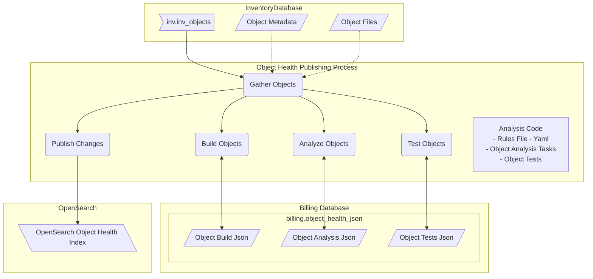
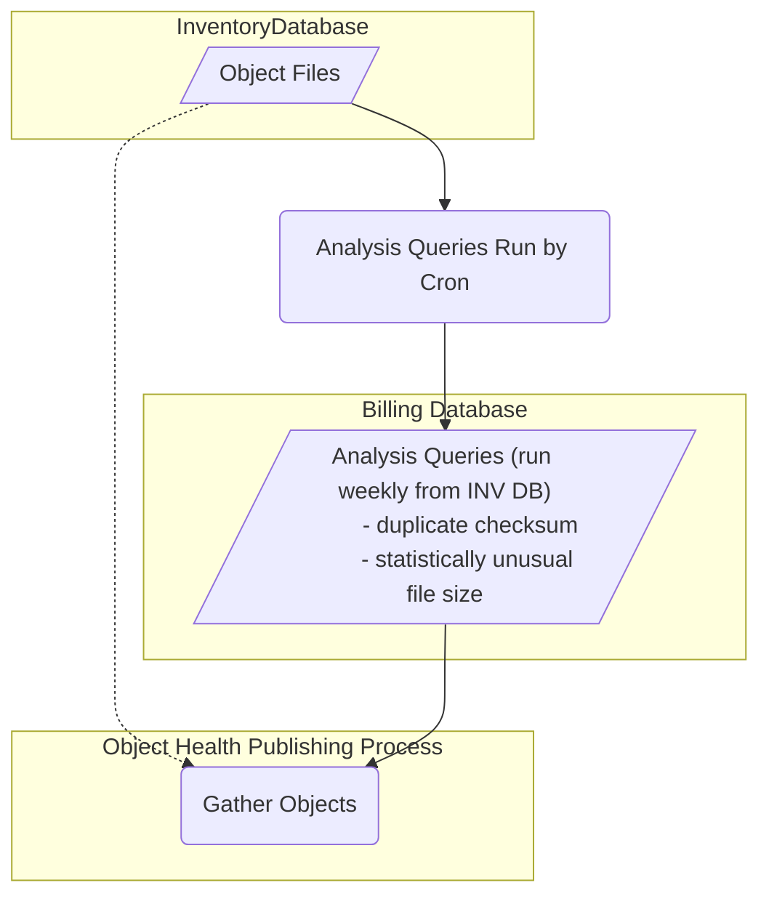
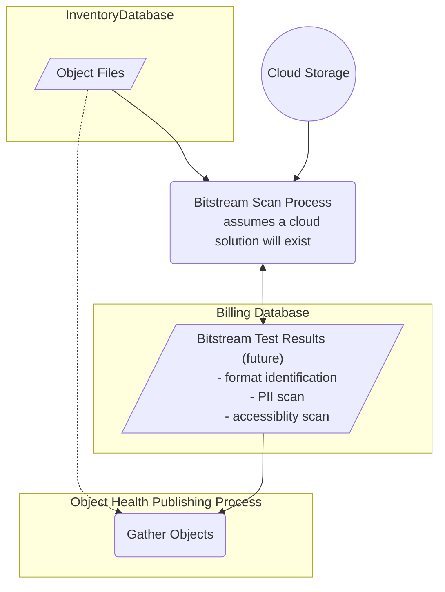

# Merritt Collection Health Analysis and Reporting
### Overview
As evidenced by our recent recertification with CoreTrustSeal, in-depth curation across the wide range of collections being preserved in Merritt is a task that stands to benefit from the assistance of an automated process capable of providing regular reports to depositors with key insights into collection composition. 

Unlike a traditional curation workflow, where archivists work to define metadata and Submission Information Package (SIP) composition in advance of submission to a repository, enabling the generation of a collection “health” report will provide a baseline status for existing collections whose establishment may or may not predate current depositors at the variety of libraries and memory organizations that use Merritt as a digital preservation repository.

The Merritt repository has been operational for over ten years. In its initial years, although object guidelines were provided by CDL, many objects that do not adhere to these were submitted. For example, an object may incorporate object-level ERC metadata but lacks internal metadata sidecar files that serve to further define its collection context and provenance. A retroactive process through which such characteristics are flagged will assist owners to assess whether a specific collection is in need of additional curation, resulting in the creation of new object versions.

We intend the collection health check process to examine a number of file and object conditions when it is executed. Checks will be based on both file and object datasets, each of which will gather characteristics of the data type at hand. 

The definition of these conditions are intended to incorporate both internal best practices as defined at campus libraries and the CDL, as well as external community resources such as the Library of Congress [Recommended Formats Statement](https://www.loc.gov/preservation/resources/rfs/introduction.html) (RFS) and the Digital Preservation Coalition’s Bit-List. Community resources provide input on preferred and acceptable formats within high-level categories, as well as cite a range of “endangered” file formats. While others, such as the [DigiPres Commons](https://www.digipres.org/formats/) Formats and MIME Types lists provide references linked to backing information sourced from [WikiData](https://www.wikidata.org/) and [Apache Tika](https://tika.apache.org/).

### Use Cases
#### Configure
Collection check configuration:
- Enable the programmatic configuration of collection checks including result statuses: pass, fail, warn, skip, info.
- Enable configuration of mime type usage.
#### Enhance
Collection check enhancements:
- Provide the ability to enhance collection checks over time according to campus partner feedback.
#### Examine and Report: Files
Collection analysis at the file level:
- Enable data extraction at the file level for analysis.
- Provide for bulk extraction as well as daily extraction.
- Generate collection-specific report with results of analysis.
#### Examine and Report: Objects
Collection analysis at the object level:
- Enable data extraction at the object level for analysis.
- Provide for bulk extraction as well as daily extraction.
- Generate collection-specific report with results of analysis.
### Usage
The collection health process will center on scanning selected collections for depositors. As it entails generating datasets based on both collection files and objects, it is preferred from a compute and infrastructure perspective to scan individual collections on request, rather than scan all holdings that reside in the repository.
### Collection Health Checks
At the core of the health check process is a series of customizable candidate tests that are to be run on the file and object datasets generated for a collection. These tests are enumerated in an easily editable YAML-based analysis schema which defines the conditions for whether a test passes or fails, or a warning or informational status message is rendered. Examples of checks to run include but are not limited to:
#### File level
- MIME type sustainability
- Filename validation
- File extension validation
- Empty file detection
#### Object level
- Presence of meaningful object-level ERC metadata
- Presence of sidecar metadata file(s)
- Local ID conforms to established collection-specific convention
- Presence and count of content files
- Version count and range
#### Implementation Strategy
Communications:
- Messaging regarding the Collection Health project to take place:
  - Directly with campus partners
  - Through DPLG overview
  - Use and review of file level data dashboard

Prototyping:
- File level data extraction and visualization in OpenSearch. Extract file level data and generate a dashboard in OpenSearch that reveals this for review.
- Object level data extraction
  - Storage of object data as JSON in MySQL records
  - Process to update object data records in OpenSearch
#### Leveraging OpenSearch
The OpenSearch frontend will provide the visual analysis tooling necessary to visualize and build dashboards within for communicating health check reports to campus partners. Integration points and uses of OpenSearch infrastructure include but are not limited to:
- Generating JSON files from MySQL records
- Capturing collection name, owner, mime-type, bytes, etc.
- Creating OpenSearch visualizations
- Linking visualizations through a dashboard

Pre-processing data to:
- Enable the ability for us to recognize specific mime-types according to preferred, acceptable formats in the LOC RFS 
- Flag outliers mime-types in a collection
- Recognize objects that:
  - Have metadata sidecar files
  - Meaningful object-level ERC metadata
- Recognize files that:
  - Are within a typical byte size (file and object basis)
  - Adhere to naming conventions in a collection

Provide a means to:
- Review collection report results
- Annotate/comment on results
- Lend enough information for owners to make decisions on file migration
## 

# Collection Health Object Analysis


## Set environment (DEV)
```
export COLLHDATA=$PWD
```

## Set environment
```
export COLLHDATA=/dpr2/apps/mrt-cron/coll_health/data
cd {merrit-cron-install}/coll-health-object-analysis
```

## New Database Table
_Copy to https://github.com/CDLUC3/mrt-admin-lambda/blob/main/merrit-billing/schema.sql when complete._

```sql
/*
DROP TABLE IF EXISTS object_health_json;
*/
CREATE TABLE object_health_json (
  inv_object_id int,
  build json,
  build_updated datetime,
  analysis json,
  analysis_updated datetime,
  tests json,
  tests_updated datetime,
  UNIQUE INDEX object_id(inv_object_id),
  INDEX i_build(build_updated),
  INDEX i_analysis(analysis_updated),
  INDEX i_tests(tests_updated)
);
```
## Install
```
bundle install
```

## Invocation
```
bundle exec ruby object_health.rb
```


## System Design

### Initial Analysis - Built from RDS Data



### Statistical Analysis 
This analysis will require complex queries to run weekly to support the analysis.



### Bitstream Analysis 
These components will be more compuationally expensive to implement.  
The results of these analyses should feed into the existing Object Health process.



---

## Estimates - Initial Analysis

### Retrospective Json Generation

- 4M object * 8KB/object = 32GB
  - or 3M if we exclude specific collections 
- 32GB RDS storage (billing.object_health_json) 
- 32GB OpenSearch storage (objhealth index)
- Compute to produce 4M JSON documents
  - use available compute on Merritt batch server
  - run within Lambda

### Prospective Json Generation (adds and updates to objects)

- 8K/object added to RDS and OpenSearch
- Compute to process updates

### Test refinement
- Compute to partially re-process 4M objects

## Estimates - Statistical Analysis

- Weekly cron jobs
- Additional join tables 
  - repeated checksums (1M rows)
  - average/mean size per mime per collection (may already exist in the billing database)

## Estimates - Bitstream Analysis

### Tasks to run
- File identification 
  - All files 34M
- PII scan?
  - Data, Text, Image? (30M)
- Accessibility scan?
  - Text, Video? (20M)

### Content Breakdown
- audio	- 174,608
- container	- 448,449
- data	-- Total --	1,579,481
- image	-- Total --	11,689,378
- text	-- Total --	19,797,445
- video	-- Total --	68,931

### Cost

- Assumption: 1K json per bitstream = 34G in RDS
- Compute per bitstream - will need to calculate by service
  - File Id - open source
  - Accessibility - open source?
  - PII scan - vendor solution
- Bitstream retrieval - 500T

---

## Script Notes

Builds
```
bundle exec ruby object_health.rb -bat --limit 500 --tag=tag_test_set

```

Build - Small Set
```
bundle exec ruby object_health.rb -bat --limit 20 --tag=tag_test_set --clear-build
```

Re-build
```
bundle exec ruby object_health.rb -bat --clear-build --limit 10000 --query=has-build
```

Re-analyze
```
bundle exec ruby object_health.rb -at --clear-analysis --limit 10000 --query=has-build
```

Re-test
```
bundle exec ruby object_health.rb -t --clear-tests --limit 10000 --query=has-build
```