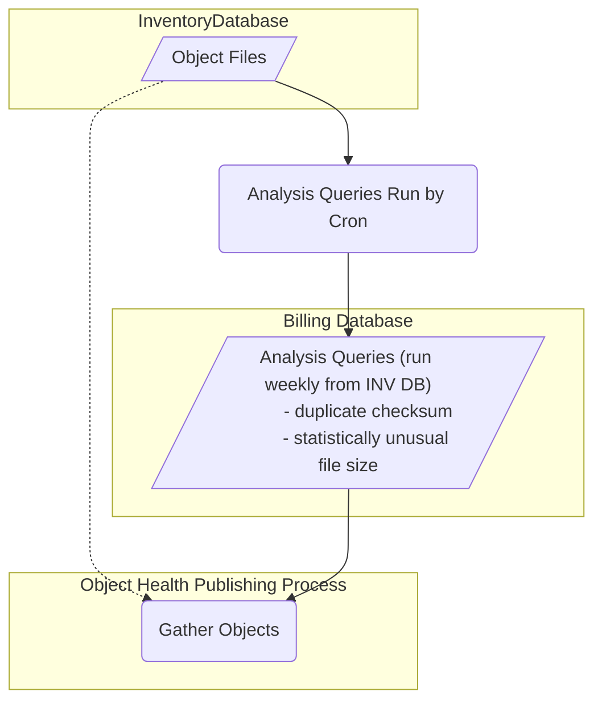
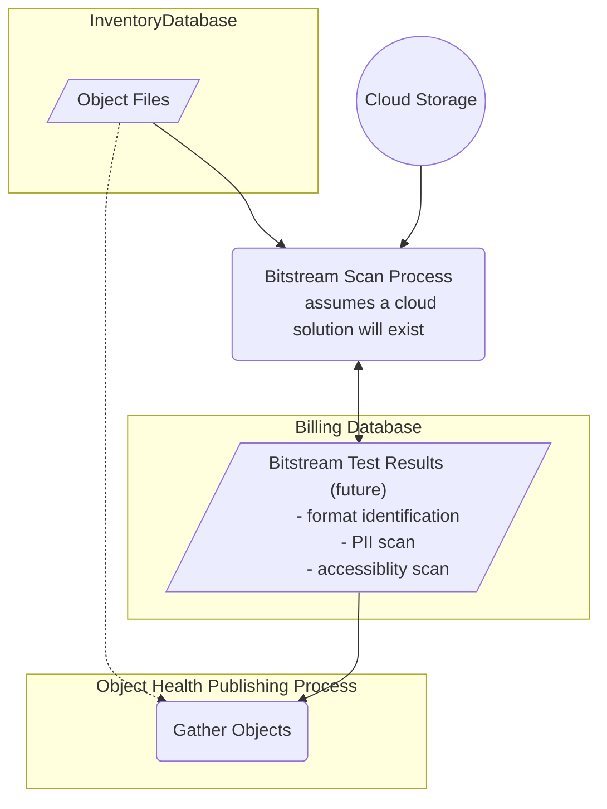

# Collection Health Object Analysis


## Set environment (DEV)
```
export COLLHDATA=$PWD
```

## Set environment
```
export COLLHDATA=/dpr2/apps/mrt-cron/coll_health/data
cd {merrit-cron-install}/coll-health-object-analysis
```

## New Database Table
_Copy to https://github.com/CDLUC3/mrt-admin-lambda/blob/main/merrit-billing/schema.sql when complete._

```sql
/*
DROP TABLE IF EXISTS object_health_json;
*/
CREATE TABLE object_health_json (
  inv_object_id int,
  build json,
  build_updated datetime,
  analysis json,
  analysis_updated datetime,
  tests json,
  tests_updated datetime,
  UNIQUE INDEX object_id(inv_object_id)
);
```
## Install
```
bundle install
```

## Invocation
```
bundle exec ruby object_health.rb
```


## System Design

### Initial Analysis - Built from RDS Data


### Statistical Analysis 
This analysis will require complex queries to run weekly to support the analysis.



### Bitstream Analysis 
These components will be more compuationally expensive to implement.  
The results of these analyses should feed into the existing Object Health process.



---

## Estimates - Initial Analysis

### Retrospective Json Generation

- 4M object * 8KB/object = 32GB
  - or 3M if we exclude specific collections 
- 32GB RDS storage (billing.object_health_json) 
- 32GB OpenSearch storage (objhealth index)
- Compute to produce 4M JSON documents
  - use available compute on Merritt batch server
  - run within Lambda

### Prospective Json Generation (adds and updates to objects)

- 8K/object added to RDS and OpenSearch
- Compute to process updates

### Test refinement
- Compute to partially re-process 4M objects

## Estimates - Statistical Analysis

- Weekly cron jobs
- Additional join tables 
  - repeated checksums (1M rows)
  - average/mean size per mime per collection (may already exist in the billing database)

## Estimates - Bitstream Analysis

### Tasks to run
- File identification 
  - All files 34M
- PII scan?
  - Data, Text, Image? (30M)
- Accessibility scan?
  - Text, Video? (20M)

### Content Breakdown
- audio	- 174,608
- container	- 448,449
- data	-- Total --	1,579,481
- image	-- Total --	11,689,378
- text	-- Total --	19,797,445
- video	-- Total --	68,931

### Cost

- Assumption: 1K json per bitstream = 34G in RDS
- Compute per bitstream - will need to calculate by service
  - File Id - open source
  - Accessibility - open source?
  - PII scan - vendor solution
- Bitstream retrieval - 500T

---

## Interesting Open Search Queries
- `tests.FAIL > 0`
- `tests.WARN > 0`
- `build.file_counts.deleted > 0 AND build.producer.deleted: true`
- `build.file_counts.empty: 0`

## Script Notes

Builds
```
bundle exec ruby object_health.rb -b -a -t --limit 1200 --mnemonic=merritt_demo
#bundle exec ruby object_health.rb -b -a -t --limit 1200 --mnemonic=merritt_demo --clear-build
bundle exec ruby object_health.rb -b -a -t --limit 500 --mnemonic=ucm_lib_mclean
bundle exec ruby object_health.rb -b -a -t --limit 500 --mnemonic=ucb_lib_bancroft
bundle exec ruby object_health.rb -b -a -t --limit 500 --mnemonic=ucla_dash
bundle exec ruby object_health.rb -b -a -t --limit 500 --mnemonic=ucsc_lib_sc
bundle exec ruby object_health.rb -b -a -t --limit 500 --mnemonic=ucb_lib_church
bundle exec ruby object_health.rb -b -a -t --limit 500 --mnemonic=ucr_lib_nuxeo
bundle exec ruby object_health.rb -b -a -t --limit 500 --mnemonic=ucb_bampfa_art
bundle exec ruby object_health.rb -b -a -t --limit 500 --mnemonic=ucla_lib_frontera
bundle exec ruby object_health.rb -b -a -t --limit 500 --mnemonic=ucla_lib_str_frontera
bundle exec ruby object_health.rb -b -a -t --limit 500 --mnemonic=ucr_lib_etd
bundle exec ruby object_health.rb -b -a -t --limit 500 --mnemonic=ucla_lib_etd
```

Build - Small Set
```
bundle exec ruby object_health.rb -b -a -t --limit 20 --mnemonic=merritt_demo
#bundle exec ruby object_health.rb -b -a -t --limit 20 --mnemonic=merritt_demo --clear-build
bundle exec ruby object_health.rb -b -a -t --limit 10 --mnemonic=ucm_lib_mclean
bundle exec ruby object_health.rb -b -a -t --limit 10 --mnemonic=ucb_lib_bancroft
bundle exec ruby object_health.rb -b -a -t --limit 10 --mnemonic=ucla_dash
bundle exec ruby object_health.rb -b -a -t --limit 10 --mnemonic=ucsc_lib_sc
bundle exec ruby object_health.rb -b -a -t --limit 10 --mnemonic=ucb_lib_church
bundle exec ruby object_health.rb -b -a -t --limit 10 --mnemonic=ucr_lib_nuxeo
bundle exec ruby object_health.rb -b -a -t --limit 10 --mnemonic=ucb_bampfa_art
bundle exec ruby object_health.rb -b -a -t --limit 10 --mnemonic=ucla_lib_frontera
bundle exec ruby object_health.rb -b -a -t --limit 10 --mnemonic=ucla_lib_str_frontera
bundle exec ruby object_health.rb -b -a -t --limit 10 --mnemonic=ucr_lib_etd
bundle exec ruby object_health.rb -b -a -t --limit 10 --mnemonic=ucla_lib_etd
```

Re-build
```
bundle exec ruby object_health.rb -b -a -t --clear-build --clear-analysis --clear-tests --limit 10000 --query=has-build
```

Re-analyze
```
bundle exec ruby object_health.rb -a -t --clear-analysis --clear-tests --limit 10000 --query=has-build
```

Re-test
```
bundle exec ruby object_health.rb -t --clear-tests --limit 10000 --query=has-build
```