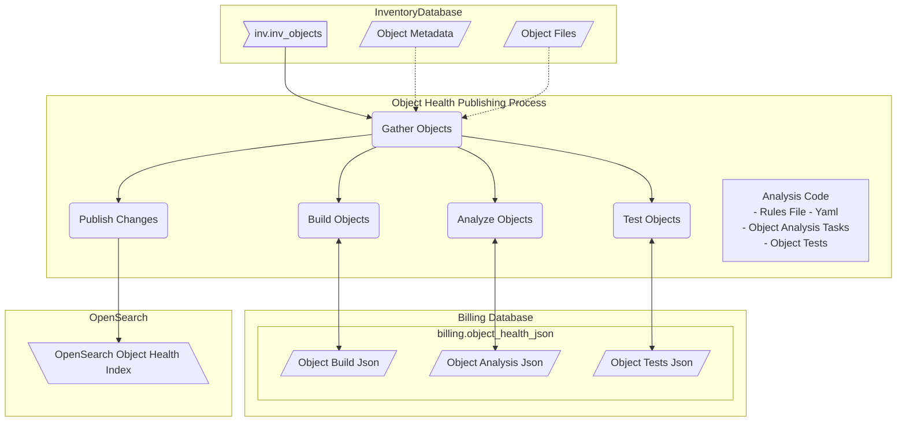

## Data Model

### Create an Object using the Merritt inv_object_id as an identifier
```json
{
    "id": 3632877,
    "@timestamp": "2023-11-06T13:44:35-0800",
}
```

### Create a build Object to capture information known about the object the the Merritt Inventory Database
```json
{
    "id": 3632877,
    "@timestamp": "2023-11-06T13:44:35-0800",
    "build": {
      "id": 3632877
    },
    "@timestamp": "2023-11-06T13:44:35-0800",
}
```

### Add identfiers
```json
{
    "id": 3632877,
    "@timestamp": "2023-11-06T13:44:35-0800",
    "build": {
      "id": 3632877,
      "identifiers": {
        "ark": "ark:/99999/fk47708705",
        "localids": [
          "2023_10_30_1625_v1file"
        ]
      },
    },
    "@timestamp": "2023-11-06T13:44:35-0800",
}
```



