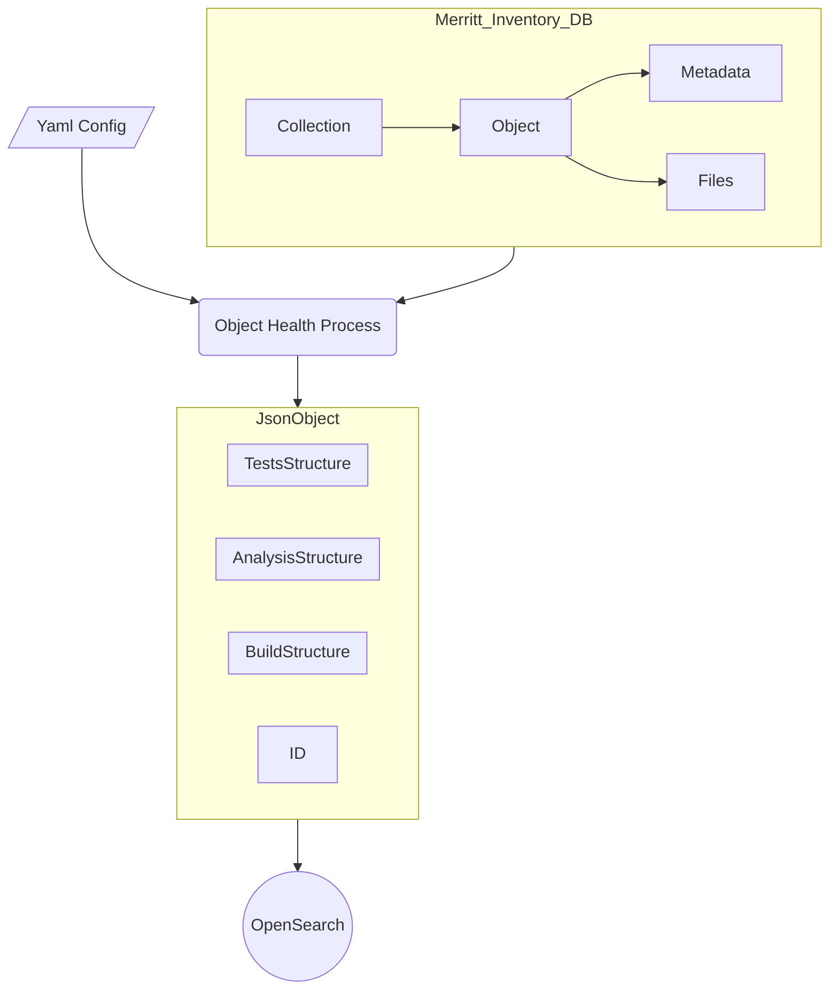
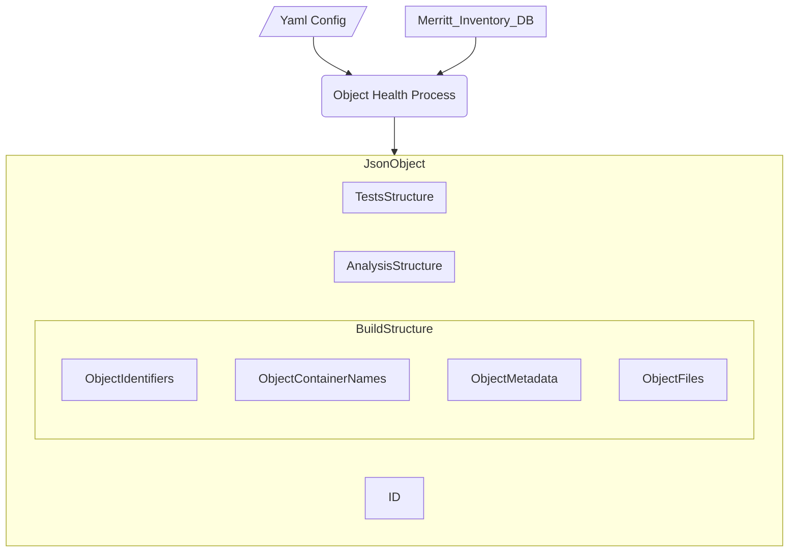
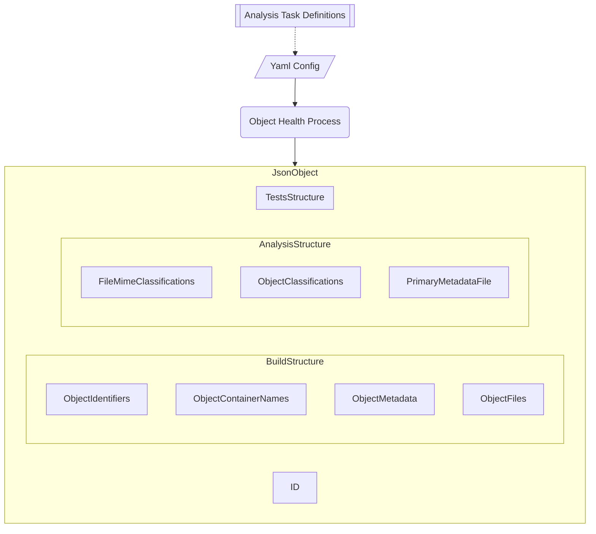
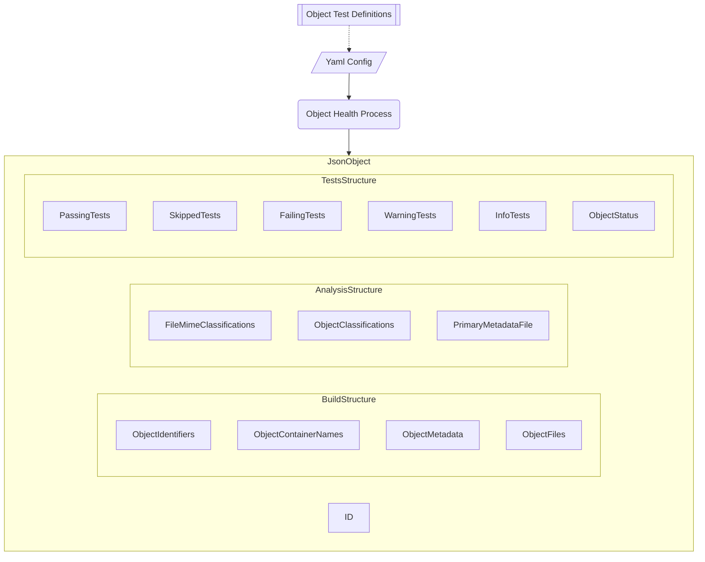
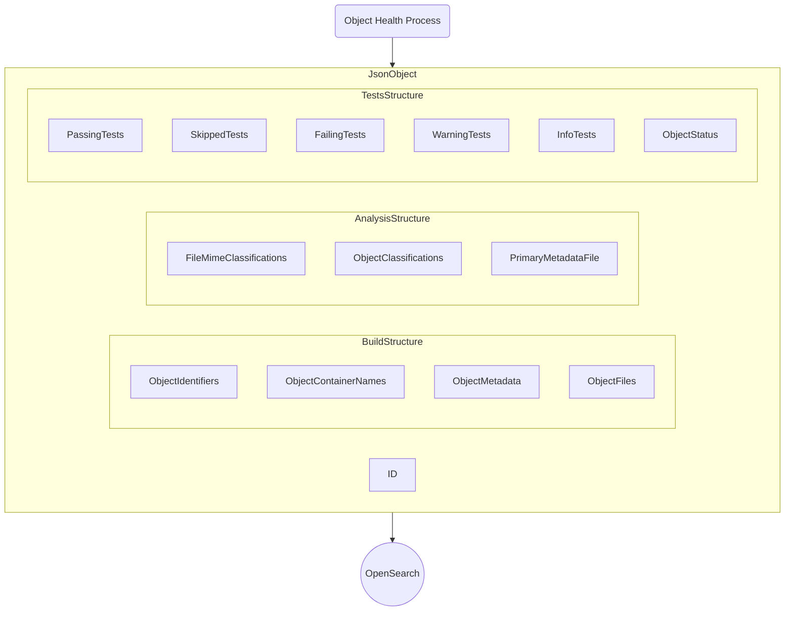

# Merritt Object Health Data Model



The Merritt Object Health process will build a highly structured JSON document for each of the 4 million+ objects stored in the Merritt preservation system.

The JSON documents will be designed to support searching, filtering and faceting using OpenSearch for analysis.

The process consists of 3 phases which will be captured within the object JSON.

- **Build**: Extract known information about an object from the inventory database
- **Analysis**: Apply a set of **Analysis Tasks** to the build structure to classify and categorize the objects
- **Tests**: Apply a set of **Object Tests** against the build and analysis structures each of which will result in one of the following status values
  - SKIP: A test is skipped if it is not applicable to a specific object or to its containing collection
  - PASS: The object meets the optimal criteria for a Merritt object
  - INFO: The object does not meet the optimal criteria for a Merritt object but no action is expected
  - WARN: The object does not meet the optimal criteria for a Merritt object and some investigation is recommended 
  - FAIL: The object does not meet the criteria for a Merritt object and remediation is recommended

## Collection Taxonomy

The object health process is configured by a yaml file that defines that processing that will be applied.

Merritt content can be categorized into a taxonomy of collections.  

Tasks can be applied to objects based on this taxonomy.  The collections to prioritize for this analyis will also be controlled by this taxonomy.

<details>
<summary>Sample Yaml Snippet</summary>
_The following snippet is an illustrative example of the data defined in yaml_

```yaml
  # -------------------
  # Collection Taxonomy
  #   This can be used to include/exclude specific collections from specific Analysis Tasks and Tests
  # -------------------
  collection_taxonomy:
    - name: Skip Tests
      groups: 
        tag_skip:
      mnemonics:
        ucb_open_context:
        cdl_dryad:
        cdl_uc3_etdreports:
    - name: Initial Test Set
      groups:
        tag_test_set:
      mnemonics:
        merritt_demo:
        ucb_bampfa_art:
        ucb_lib_bancroft:
        ucb_lib_church:
        ucb_lib_examiner:
        ucb_lib_sugoroku:
        ucla_dash:
        ucla_lib_etd:
          tags:
            tag_etd:
        ucla_lib_frontera:
        ucla_lib_str_frontera:
        ucm_lib_mclean:
        ucr_lib_etd:
          tags:
            tag_etd:
        ucr_lib_nuxeo:
        ucsc_lib_sc:
        ucsf_ctp_archive:
        cdl_ipresbo:
```

</details>

## Object Build Process



The **Build** process is intended to extract and assemble known information about an object.

Because some Merritt objects contain tens of thousands of objects, this phase of processing does perform minimal analysis of each file within an object.  

Only the first 1000 files within an object will be detailed in the build structure.

<details>
<summary><h3>JSON Snippets for the BUILD Property</h3></summary>

#### Create JSON object

Create a JSON object using the Merritt _inv_object_id_ as an identifier

<details>
<summary>Sample Json</summary>
    
```json
{
    "id": 3632877,
    "@timestamp": "2023-11-06T13:44:35-0800",
}
```

</details>

#### Create _build_ property

Create the build property to capture information known about the object the the Merritt Inventory Database

<details>
<summary>Sample Json</summary>
    
```json
{
    "id": 3632877,
    "@timestamp": "2023-11-06T13:44:35-0800",
    "build": {
      "id": 3632877
    },
    "@timestamp": "2023-11-06T13:44:35-0800",
}
```

</details>

#### Object Identifiers

Add identfiers for the object.  

These can be used to locate the object in Merritt or in OpenSearch.

<details>
<summary>Sample Json</summary>
    
```json
{
    "id": 3632877,
    "@timestamp": "2023-11-06T13:44:35-0800",
    "build": {
      "id": 3632877,
      "identifiers": {
        "ark": "ark:/99999/fk47708705",
        "localids": [
          "2023_10_30_1625_v1file"
        ]
      },
    },
    "@timestamp": "2023-11-06T13:44:35-0800",
}
```

</details>

#### Object Containers

Add information about the containers for the object.  

These allow for filtering for similar objects.

<details>
<summary>Sample Json</summary>
  
```json
{
    "id": 3632877,
    "@timestamp": "2023-11-06T13:44:35-0800",
    "build": {
      "id": 3632877,
      "identifiers": {},
      "containers": {
        "owner_ark": "ark:/13030/j2rn30xp",
        "owner_name": "UC3 Merritt administrator",
        "coll_ark": "ark:/13030/m5rn35s8",
        "coll_name": "Merritt demo",
        "mnemonic": "merritt_demo",
        "collection_tags": [
          "tag_test_set"
        ],
        "campus": "Other"
      },
    },
    "@timestamp": "2023-11-06T13:44:35-0800",
}
```

</details>

#### Object Metadata

Add metadata for the object.  

The Merritt inventory database maintains minimal metadata (what, who, when, where) for each object.

<details>
<summary>Sample Json</summary>

```json
{
    "id": 3632877,
    "@timestamp": "2023-11-06T13:44:35-0800",
    "build": {
      "id": 3632877,
      "identifiers": {},
      "containers": {},
      "metadata": {
        "erc_who": "(:unas)",
        "erc_what": "2023_10_30_1625_v1file v1_file.md.v2",
        "erc_when": "(:unas)",
        "erc_where": "ark:/99999/fk47708705 ; 2023_10_30_1625_v1file"
      },
    },
    "@timestamp": "2023-11-06T13:44:35-0800",
}
```

</details>

#### System Files

Add detailed information about Merritt System Files for the object.

<details>
<summary>Sample Json</summary>

```json
{
    "id": 3632877,
    "@timestamp": "2023-11-06T13:44:35-0800",
    "build": {
      "id": 3632877,
      "identifiers": {},
      "containers": {},
      "metadata": {},
      "system": [
        {
          "version": 1,
          "last_version_present": 2,
          "source": "system",
          "pathname": "system/mrt-dc.xml",
          "billable_size": 149,
          "mime_type": "application/xml",
          "digest_type": "sha-256",
          "digest_value": "f40dd72e54b7e93c389895de1c13922fe5ac2ac226d7159a9704ae6f19a67929",
          "created": "2023-10-30 16:29:27 -0700",
          "pathtype": "file",
          "ext": "xml"
        },
        {
          "version": 2,
          "last_version_present": 2,
          "source": "system",
          "pathname": "system/mrt-erc.txt",
          "billable_size": 135,
          "mime_type": "text/plain",
          "digest_type": "sha-256",
          "digest_value": "2bedd9c897320081a275393d72fbabe1f777795e4a56773d9c48da7608ac2c32",
          "created": "2023-10-30 16:29:28 -0700",
          "pathtype": "file",
          "ext": "txt"
        }
      ],
    },
    "@timestamp": "2023-11-06T13:44:35-0800",
}
```
</details>

#### Producer Files

Add detailed information about Merritt Producer Files for the object.

_Detailed information will be recorded for up to 1000 objects._


<details>
<summary>Sample Json</summary>

```json
{
    "id": 3632877,
    "@timestamp": "2023-11-06T13:44:35-0800",
    "build": {
      "id": 3632877,
      "identifiers": {},
      "containers": {},
      "metadata": {},
      "system": [],
      "producer": [
        {
          "version": 1,
          "last_version_present": 2,
          "source": "producer",
          "pathname": "producer/v1_file.md",
          "billable_size": 4,
          "mime_type": "text/x-web-markdown",
          "digest_type": "sha-256",
          "digest_value": "9f86d081884c7d659a2feaa0c55ad015a3bf4f1b2b0b822cd15d6c15b0f00a08",
          "created": "2023-10-30 16:29:27 -0700",
          "pathtype": "file",
          "ext": "md"
        },
        {
          "version": 2,
          "last_version_present": 2,
          "source": "producer",
          "pathname": "producer/v1_file.md.v2",
          "billable_size": 4,
          "mime_type": "text/plain",
          "digest_type": "sha-256",
          "digest_value": "9f86d081884c7d659a2feaa0c55ad015a3bf4f1b2b0b822cd15d6c15b0f00a08",
          "created": "2023-10-30 16:29:28 -0700",
          "pathtype": "file",
          "ext": "v2"
        }
      ],
    },
    "@timestamp": "2023-11-06T13:44:35-0800",
}
```
</details>

#### File counts

Add summary information about the set of files found in the object

_Includes ALL files, not just the first 1000 files_


<details>
<summary>Sample Json</summary>

```json
{
    "id": 3632877,
    "@timestamp": "2023-11-06T13:44:35-0800",
    "build": {
      "id": 3632877,
      "identifiers": {},
      "containers": {},
      "metadata": {},
      "system": [],
      "producer": [],
      "file_counts": {
        "deleted": 0,
        "empty": 0,
        "producer": 2,
        "system": 6
      },
      "mimes_for_object": [
        {
          "mime": "text/x-web-markdown",
          "count": 1
        },
        {
          "mime": "text/plain",
          "count": 1
        }
      ],
    },
    "@timestamp": "2023-11-06T13:44:35-0800",
}
```
</details>

#### Version and Date Modified

Capture version information about the object and the last modified date

<details>
<summary>Sample Json</summary>

```json
{
    "id": 3632877,
    "@timestamp": "2023-11-06T13:44:35-0800",
    "build": {
      "id": 3632877,
      "identifiers": {},
      "containers": {},
      "metadata": {},
      "system": [],
      "producer": [],
      "file_counts": {},
      "mimes_for_object": [],
      "version": 2,
      "modified": "2023-10-30T16:29:29-07:00",
    },
    "@timestamp": "2023-11-06T13:44:35-0800",
}
```
</details>

#### Embargo

Capture embargo information about the object (if present)

<details>
<summary>Sample Json</summary>

```json
{
    "id": 3632877,
    "@timestamp": "2023-11-06T13:44:35-0800",
    "build": {
      "id": 3632877,
      "identifiers": {},
      "containers": {},
      "metadata": {},
      "system": [],
      "producer": [],
      "file_counts": {},
      "mimes_for_object": [],
      "version": 2,
      "modified": "2023-10-30T16:29:29-07:00",
      "embargo_end_date": "",
    },
    "@timestamp": "2023-11-06T13:44:35-0800",
}
```
</details>

#### Ignored Files

Capture specific files (based on file name) that will be ignored by all subsequent analysis steps.

<details>
<summary>Sample Json</summary>

```json
{
    "id": 3632877,
    "@timestamp": "2023-11-06T13:44:35-0800",
    "build": {
      "id": 3632877,
      "identifiers": {},
      "containers": {},
      "metadata": {},
      "system": [],
      "producer": [],
      "file_counts": {},
      "mimes_for_object": [],
      "version": 2,
      "modified": "2023-10-30T16:29:29-07:00",
      "embargo_end_date": "",
      "ignore_files": [
        "producer/Thumbs.db",
      ]
    },
    "@timestamp": "2023-11-06T13:44:35-0800",
}
```
</details>

#### Sidecar Metadata

Capture metadata sidecar information about the object

_If present in the inventory database **inv_metadatas** table. Data contains a dump of dublin core type metadata._


<details>
<summary>Sample Json</summary>
  
```json
{
    "id": 3632877,
    "@timestamp": "2023-11-06T13:44:35-0800",
    "build": {
      "id": 3632877,
      "identifiers": {},
      "containers": {},
      "metadata": {},
      "system": [],
      "producer": [],
      "file_counts": {},
      "mimes_for_object": [],
      "version": 2,
      "modified": "2023-10-30T16:29:29-07:00",
      "embargo_end_date": "",
      "sidecar": [
        {
          "identifier": [],
          "creatorName": [],
          "nameIdentifier": [],
          "affiliation": [],
          "title": [],
          "publisher": [],
          "resourceType": [],
          "publicationYear": [],
          "subject": [],
          "description": []
        },
        {}
      ]
    },
    "@timestamp": "2023-11-06T13:44:35-0800",
}
```

</details>

</details>

---

## Object Analysis Process



The Analysis process is driven by a set of tests defined in the project's yaml config file.

A set of **Analysis Tasks** are defined in yaml (along with the name of a class that will perform the task).

Wherever possible, the results of the analysis process are configurable in the yaml file.

<details>
<summary>Sample Yaml Snippet</summary>
_The following snippet is an illustrative example of the data defined in yaml_

```yaml
  analysis_json:
    # -------------------
    # Organize known Merritt mime types by sustainability criteria.
    # Organization of mime types will be updated over time to incorporate community best practices.
    # Also, document the expected file extensions for each sustainable mime type.
    # 
    # The PASS and INFO mime types will be utilized to identify digital file content within an object.
    # Each object will be expected to contain at least one file from each of these groups.
    #
    # Apache Tika has been used within Merritt to identify mime types (TBD verify).  
    # Also, this information can be sent by depositors.
    # The results of this analysis may suggest that Merritt should process all content files with file identification software.
    # -------------------
    mime:
      class: MimeTask
      PASS: &sustainable_mimes_pass 
        text/plain: ["txt"]
        application/xml: ["xml"]
        image/jpeg: ["jpg", "jpeg"]
      # Leave SKIP blank to help identify unfound mimes
      SKIP:
      FAIL:
      # x-pkcs: Public-Key Cryptography Standards files provide for certificate storage
        application/x-pkcs12: []
        application/x-pkcs7-certificates: []
      WARN: &sustainable_mimes_warn
        application/octet-stream: []
        application/vnd.chipnuts.karaoke-mmd: []
        application/vnd.ms-excel.sheet.macroenabled.12: []
      INFO: &sustainable_mimes_info
        application/x-hdf: []
        application/x-matlab-data: []
        text/x-rsrc: []
        application/x-gtar: ["gz"]
    # -------------------
    # Classify Object Producer Files based on an ordered set of rules
    #
    # Content Classifications
    # - complex_object - container file found or preservation files of multiple mime types found within the object
    # - has_multi_digital_files_with_derivatives - multiple preservation files of the same mime type found and derivative files found
    # - has_multi_digital_files - multiple preservation files of the same mime type found
    # - has_digital_file_with_derivatives - preservation and derivative files found
    # - has_derivatives_only - only derivative content files found
    # - has_single_digital_file - one identifiable content file
    # - has_no_content - no identifiable content files
    #
    # Metadata Classifications
    # - has_common_metadata_file: "Common" Merritt metadata file 
    # - has_bag_metadata_file: Bag metadata file derived from a bagged object
    # - has_etd_metadata_file: Metadata sidecar file for an ETD submission
    # - has_nuxeo_style_metadata_file: Metadata sidecar file for a Nuxeo submission
    # - has_metadata_with_secondary: Primary metadata sidecar file plus other metadata files
    # - has_single_metadata_file: Primary metadata sidecar file
    # - has_multi_metadata: Multiple potential metadata sidecar files
    # - has_secondary_metadata_only: Files containing metadata that would not be classified as a sidecar file. A sidecar is assumed to have richer metadata than a Merritt ERC file.
    # - has_no_sidecar_metadata: No identifiable metadat file found
    # -------------------
    classify:
      class: ClassifyTask
      # These categorizations are applied in ranked order allowing the re-use of blocks of mime types
      metadata_types:
        common_metadata:
        nuxeo_style_metadata:
        bag_metadata:
        etd_metadata:
        metadata:
      categorize:
      # If multiple common metadata files are found, the primary metadata file will be chosen in the following priority order
      - name: common_metadata
        # this indicates that the first match will be used regardless of the number of matches
        ordered_paths: true
        paths:
        - mets.xml
        - mets.txt
        - mrt-dc.xml
        - cdlmeta.tar.gz
      # If ETD metadata is found, other metadata files will not affect the categorization
      - name: etd_metadata
        patterns:
        - ^.*_(ucr|ucla)_.*_DATA.xml$
      # If Nuxeo metadata is found, other metadata files will not affect the categorization.
      # Allowable template values to look for:
      # - ARK
      - name: nuxeo_style_metadata
        templates:
        - "{{ARK}}.xml"
        - "{{LOCALID}}.xml"
      # If bag metadata is found, other metadata files will not affect the categorization.
      - name: bag_metadata
        paths:
        - bag-info.txt
      # Secondary metadata files may contain metadata, but they are not considered to be a good choice as a "primary" metadata file
      - name: secondary
        mimes:
          text/plain:
          application/xhtml+xml:
          application/atom+xml:
          text/html:
        patterns:
        - ^.*-media\.json$
        paths:
        - mrt-erc.txt
      # If mutliple metadata files are found the categorization will indicate that the primary file cannot be identified.
      - name: metadata
        mimes:
          application/xml:
          application/json:
      # Complex files may contain multiple types of digital files.  The object will need to be downloaded and expanded in order to introspect the object.
      - name: complex
        mimes:
          application/x-gzip:
          application/zip:
          application/gzip:
      # Common derivative file types.  These file types are not generally good choices for preservation on their own.  These files will generally accompany primary content files.
      - name: derivatives
        mimes:
          video/mp4:
          audio/mpeg3:
          image/jpeg:
          image/gif:
      # Common digitial files types for preservation
      # Note that this section is linking out to the sustainable mime type definitions elsewhere in the yaml file.
      # Any metadata or derivative file types should be categorized in the sections above.
      - name: content
        mimes:
          <<: *sustainable_mimes_pass
          <<: *sustainable_mimes_info
      # everything else is classified as :na

```
</details>


<details>
<summary><h3>JSON Snippets for the ANALYSIS Property</h3></summary>

#### Producer File Mime Sustainability

Analyze all producer mime types by sustainability status (defined in yaml)

<details>
<summary>Sample Json</summary>
    
```json
{
    "id": 3632877,
    "@timestamp": "2023-11-06T13:44:35-0800",
    "analysis": {
      "mimes_by_status": {
        "SKIP": [],
        "PASS": [
          "text/plain"
        ],
        "INFO": [
          "text/x-web-markdown"
        ],
        "WARN": [],
        "FAIL": []
      },
    },
    "build": {},
    "@timestamp": "2023-11-06T13:44:35-0800"
}
```

</details>

#### File Extension Mismatch

Identify file extensions that are inconsistent with the file mime type.

<details>
<summary>Sample Json</summary>
    
```json
{
    "id": 3632877,
    "@timestamp": "2023-11-06T13:44:35-0800",
    "analysis": {
      "mimes_by_status": {},
      "mime_ext_mismatch": [
        {
          "mime": "text/plain",
          "ext": "v2",
          "count": 1
        }
      ],
    },
    "build": {},
    "@timestamp": "2023-11-06T13:44:35-0800"
}
```

</details>

#### Classify each producer file

Classify each producer file by the role it plays.

<details>
<summary>Sample Json</summary>
    
```json
{
    "id": 3632877,
    "@timestamp": "2023-11-06T13:44:35-0800",
    "analysis": {
      "mimes_by_status": {},
      "mime_ext_mismatch": [],
      "mime_file_classification": {
        "na": [],
        "common_metadata": [],
        "etd_metadata": [],
        "nuxeo_style_metadata": [],
        "bag_metadata": [],
        "secondary": [
          "text/plain"
        ],
        "metadata": [],
        "complex": [],
        "derivatives": [],
        "content": [
          "text/x-web-markdown"
        ]
      }
    },
    "build": {},
    "@timestamp": "2023-11-06T13:44:35-0800"
}
```

</details>

#### Capture Metadata Path Names

<details>
<summary>Sample Json</summary>
    
```json
{
    "id": 3632877,
    "@timestamp": "2023-11-06T13:44:35-0800",
    "analysis": {
      "mimes_by_status": {},
      "mime_ext_mismatch": [],
      "mime_file_classification": {},
      "metadata_paths": {
        "common_metadata": [],
        "nuxeo_style_metadata": [],
        "bag_metadata": [],
        "etd_metadata": [],
        "metadata": []
      }
    },
    "build": {},
    "@timestamp": "2023-11-06T13:44:35-0800"
}
```

</details>

#### Count files by a taxonomy of file types

<details>
<summary>Sample Json</summary>
    
```json
{
    "id": 3632877,
    "@timestamp": "2023-11-06T13:44:35-0800",
    "analysis": {
      "mimes_by_status": {},
      "mime_ext_mismatch": [],
      "classification": {
        "na": 0,
        "common_metadata": 0,
        "etd_metadata": 0,
        "nuxeo_style_metadata": 0,
        "bag_metadata": 0,
        "secondary": 1,
        "metadata": 0,
        "complex": 0,
        "derivatives": 0,
        "content": 1
      },
      "mime_file_classification": {},
      "metadata_paths": {},
      "object_classification": "has_single_digital_file",
      "metadata_classification": "has_secondary_metadata_only",
      "primary_metadata_file": "NA"
    },
    "build": {},
    "@timestamp": "2023-11-06T13:44:35-0800"
}
```

</details>

#### Categorize Object Content based on File Types

<details>
<summary>Sample Json</summary>
    
```json
{
    "id": 3632877,
    "@timestamp": "2023-11-06T13:44:35-0800",
    "analysis": {
      "mimes_by_status": {},
      "mime_ext_mismatch": [],
      "classification": {},
      "mime_file_classification": {},
      "metadata_paths": {},
      "object_classification": "has_single_digital_file",
      "metadata_classification": "has_secondary_metadata_only",
      "primary_metadata_file": "NA"
    },
    "build": {},
    "@timestamp": "2023-11-06T13:44:35-0800"
}
```

</details>

#### Categorize Object Metadata based on File Types

<details>
<summary>Sample Json</summary>
    
```json
{
    "id": 3632877,
    "@timestamp": "2023-11-06T13:44:35-0800",
    "analysis": {
      "mimes_by_status": {},
      "mime_ext_mismatch": [],
      "classification": {},
      "mime_file_classification": {},
      "metadata_paths": {},
      "object_classification": "has_single_digital_file",
      "metadata_classification": "has_secondary_metadata_only",
    },
    "build": {},
    "@timestamp": "2023-11-06T13:44:35-0800"
}
```

</details>

#### Identify the path of the primary metadata file for the object

The path will be set if found.  Otherwise, the value will be set to "NA".

<details>
<summary>Sample Json</summary>
    
```json
{
    "id": 3632877,
    "@timestamp": "2023-11-06T13:44:35-0800",
    "analysis": {
      "mimes_by_status": {},
      "mime_ext_mismatch": [],
      "classification": {},
      "mime_file_classification": {},
      "metadata_paths": {},
      "object_classification": "has_single_digital_file",
      "metadata_classification": "has_secondary_metadata_only",
      "primary_metadata_file": "NA"
    },
    "build": {},
    "@timestamp": "2023-11-06T13:44:35-0800"
}
```

</details>

</details>

---

## Object Health Tests Process



<details>
<summary><h3>JSON Snippets for the TESTS Property</h3></summary>

#### Record the status for each test

<details>
<summary>Sample Json</summary>
    
```json
{
    "id": 3632877,
    "@timestamp": "2023-11-06T13:44:35-0800",
    "analysis": {},
    "build": {},
    "tests": {
      "sustainable-mime": "INFO",
      "mime-extension-mismatch": "FAIL",
      "mime-not-found": "PASS",
      "has-ignored-file": "PASS",
      "object-classification": "PASS",
      "metadata-classification": "WARN",
      "ext-url-like-pathname": "PASS",
      "ext-not-present": "PASS",
      "empty-file": "PASS",
      "has-delete": "PASS",
      "doesnt-have-meaningful-erc-what": "PASS",
      "doesnt-have-meaningful-erc-who": "WARN",
      "doesnt-have-meaningful-erc-when": "WARN",
      "has-embargo": "PASS",
      "no-local-id": "SKIP",
    }
  },
  "@timestamp": "2023-11-06T13:44:35-0800"
}
```

</details>

#### Capture Test Results by Status

<details>
<summary>Sample Json</summary>
    
```json
{
    "id": 3632877,
    "@timestamp": "2023-11-06T13:44:35-0800",
    "analysis": {},
    "build": {},
    "tests": {
      "by_status": {
        "INFO": [
          "sustainable-mime"
        ],
        "FAIL": [
          "mime-extension-mismatch"
        ],
        "PASS": [
          "mime-not-found",
          "has-ignored-file",
          "object-classification",
          "ext-url-like-pathname",
          "ext-not-present",
          "empty-file",
          "has-delete",
          "doesnt-have-meaningful-erc-what",
          "has-embargo"
        ],
        "WARN": [
          "metadata-classification",
          "doesnt-have-meaningful-erc-who",
          "doesnt-have-meaningful-erc-when"
        ],
        "SKIP": [
          "no-local-id"
        ]
      },
    }
  },
  "@timestamp": "2023-11-06T13:44:35-0800"
}
```

</details>

#### Count Test Results by Status

<details>
<summary>Sample Json</summary>
    
```json
{
    "id": 3632877,
    "@timestamp": "2023-11-06T13:44:35-0800",
    "analysis": {},
    "build": {},
    "tests": {
      "SKIP": 1,
      "PASS": 9,
      "INFO": 1,
      "WARN": 3,
      "FAIL": 1,
      "by_status": {},
    }
  },
  "@timestamp": "2023-11-06T13:44:35-0800"
}
```

</details>

#### Identify Non-Passing and Failing Tests

<details>
<summary>Sample Json</summary>
    
```json
{
    "id": 3632877,
    "@timestamp": "2023-11-06T13:44:35-0800",
    "analysis": {},
    "build": {},
    "tests": {
      "failures": [],
      "summary": [
        "sustainable-mime",
        "mime-extension-mismatch",
        "metadata-classification",
        "doesnt-have-meaningful-erc-who",
        "doesnt-have-meaningful-erc-when",
        "no-local-id"
      ],
      "sustainable-mime": "INFO",
      "by_status": {},
    }
  },
  "@timestamp": "2023-11-06T13:44:35-0800"
}
```

</details>

#### Set and Overall Status for the Object

<details>
<summary>Sample Json</summary>
    
```json
{
    "id": 3632877,
    "@timestamp": "2023-11-06T13:44:35-0800",
    "analysis": {},
    "build": {},
    "tests": {
      "failures": [],
      "summary": [],
      "by_status": {},
      "state": "FAIL"
    }
  },
  "@timestamp": "2023-11-06T13:44:35-0800"
}
```

</details>

</details>

---

## Publish to OpenSearch 



### OpenSearch Query

Use OpenSearch for Faceting and Filtering Json Objects


