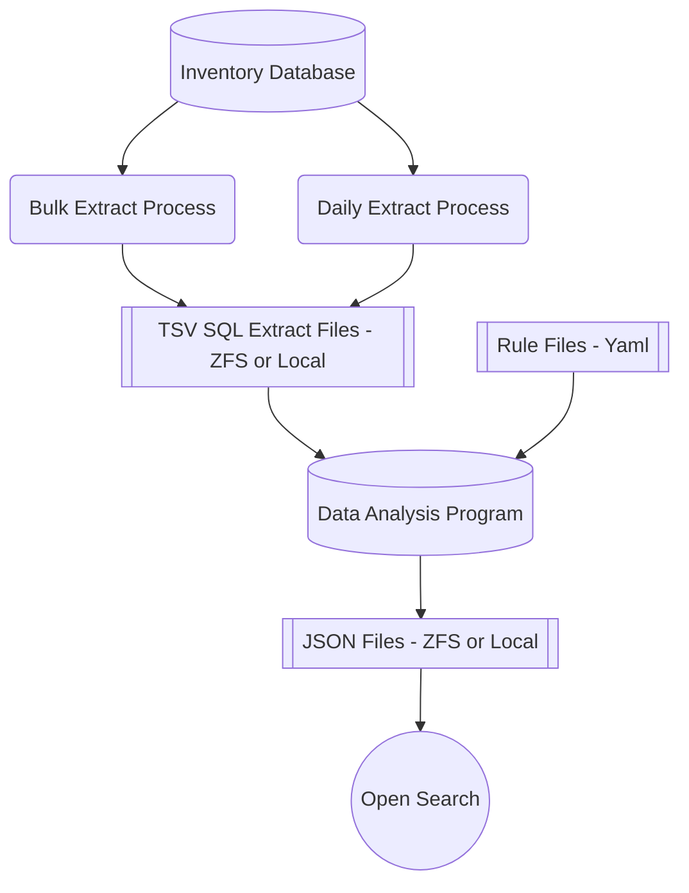

# Merritt Collection Health Report

## System Design



```
Extractions to perform (https://github.com/CDLUC3/mrt-doc/issues/1544)
- Daily Billing Summary (if needed)
  - unique id (for replacement) - does not currently exist; replace the entire index instead
  - time: data_added
- Producer Files Extract
  - unique id (for replacement) - inv_file_id
  - time: created
- Objects Extract
  - unique id (for replacement) - inv_object_id
  - time: created or modified?
```

## Bulk Extract Process
- Recreate data for all TSV files since Merritt beginnings (2013)
- Extract records by date (Year or Quarter or Month) depending on efficiency
- Create/replace TSV files
- The need to re-run should be infrequent -- only if queries need to change

## Daily Extract Process
- Query for new records since last run
- Append TSV files

## Analysis Program
- Can be run only on the newest records OR it can be run to re-process everything
- Unlike the extract process, a full rerun may occur with regularity esp if "Rule Files (yaml)" change
- Yaml files guide the analysis program
  - Registry of at-risk mime types
  - Registry of Merritt "standard" mime types
  - Registry of expected mime types based on collection intake form
  - Filename regex patterns to identify standard metadata files
- Analysis of files within an object is more complicated

## Daily Billing Extract
```
select * from owner_coll_mime_use_details;
```

Sample record (126K records)
```json
{
  "ogroup":"CDL",
  "own_name":"CDL Publishing",
  "collection_name":"eScholarship",
  "mnemonic":"escholarship",
  "date_added":"2013-05-22 00:00:00 -0700",
  "mime_type":"application/pdf",
  "mime_group":"text",
  "inv_owner_id":1,
  "inv_collection_id":1,
  "source":"producer",
  "count_files":7,
  "full_size":2699600,
  "billable_size":2564025
}
```

## Producer File Extract
- [Extract Script](mimefilelist.sh)

Sample Record (20M+ records)
```json
{
  "id":"7",
  "mnemonic":"escholarship",
  "mime":"application/pdf",
  "ark":"ark:/13030/qt4wp3r2t0",
  "path":"content/qt4wp3r2t0.pdf",
  "created":"2013-05-22 09:47:25",
  "billable_size":135575,
  "campus":"CDL",
  "owner":"CDL Publishing",
  "mime_group":"text",
  "note":"content"
}
```
