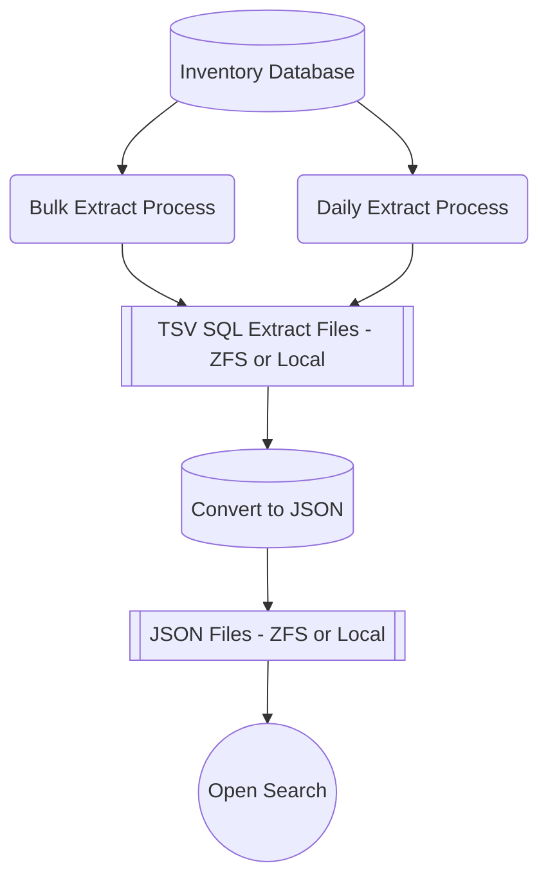

# Merritt Collection Health Report - Files Dataset

This process will create one JSON record for every Merritt producer file created.

This dataset will allow the user to construct cumulative counts for the whole Merritt system.

Inidividual filenames can be discovered in this dataset.

Note: if files have been deleted from Merritt, they will be removed from this dataset if the dataset is regenerated.

## System Design



## Code
- [Extract Script with SQL](mimefilelist.sh)
- [Ruby Code to Convert TSV to Json](mimefilelist.rb)

## Invocation

Set environment
```
export COLLHDATA=/dpr2/apps/mrt-cron/coll_health/data
cd {merrit-cron-install}/coll-health
```

Recreate file using data since 2013
```
./mimefilelist.sh all
```

Append to file since last execution

_This process looks at the date of the last extracted record._
```
./mimefilelist.sh
```

## Internal Documentation

- [Logstash and Cron Config](https://github.com/CDLUC3/uc3-ops-puppet-hiera/blob/main/fqsn/uc3-mrt-batch-prd.yaml)
- [Recreate OpenSearch Data Stream](https://github.com/CDLUC3/mrt-doc-private/blob/main/docs/system-recovery/open-search-dataset-management.md)
```
Extractions to perform (https://github.com/CDLUC3/mrt-doc/issues/1544)
- Daily Billing Summary (if needed)
  - unique id (for replacement) - does not currently exist; replace the entire index instead
  - time: data_added
- Producer Files Extract
  - unique id (for replacement) - inv_file_id
  - time: created
- Objects Extract
  - unique id (for replacement) - inv_object_id
  - time: created or modified?
```

## Bulk Extract Process
- Recreate data for all TSV files since Merritt beginnings (2013)
- Extract records by date (Year or Quarter or Month) depending on efficiency
- Create/replace TSV files
- The need to re-run should be infrequent -- only if queries need to change

## Daily Extract Process
- Query for new records since last run
- Append TSV files

## Analysis Program
- Can be run only on the newest records OR it can be run to re-process everything
- Unlike the extract process, a full rerun may occur with regularity esp if "Rule Files (yaml)" change
- Yaml files guide the analysis program
  - Registry of at-risk mime types
  - Registry of Merritt "standard" mime types
  - Registry of expected mime types based on collection intake form
  - Filename regex patterns to identify standard metadata files
- Analysis of files within an object is more complicated

## Daily Billing Extract
```
select * from owner_coll_mime_use_details;
```

Sample record (126K records)
```json
{
  "ogroup":"CDL",
  "own_name":"CDL Publishing",
  "collection_name":"eScholarship",
  "mnemonic":"escholarship",
  "date_added":"2013-05-22 00:00:00 -0700",
  "mime_type":"application/pdf",
  "mime_group":"text",
  "inv_owner_id":1,
  "inv_collection_id":1,
  "source":"producer",
  "count_files":7,
  "full_size":2699600,
  "billable_size":2564025
}
```

## Producer File Extract
- [Extract Script](mimefilelist.sh)

Sample Record (20M+ records)
```json
{
  "id":"7",
  "mnemonic":"escholarship",
  "mime":"application/pdf",
  "ark":"ark:/13030/qt4wp3r2t0",
  "path":"content/qt4wp3r2t0.pdf",
  "created":"2013-05-22 09:47:25",
  "billable_size":135575,
  "campus":"CDL",
  "owner":"CDL Publishing",
  "mime_group":"text",
  "note":"content"
}
```
